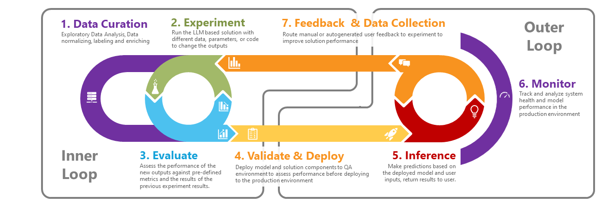
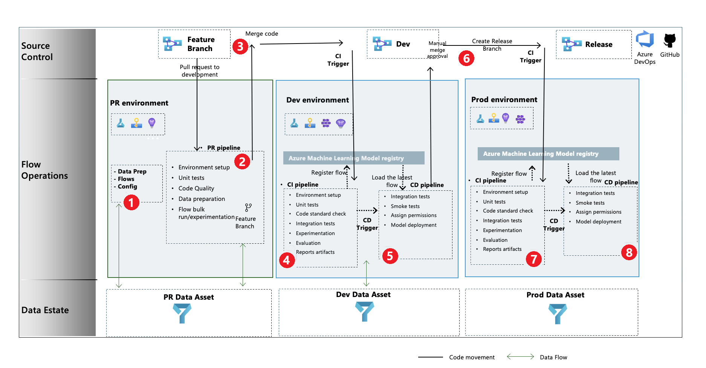
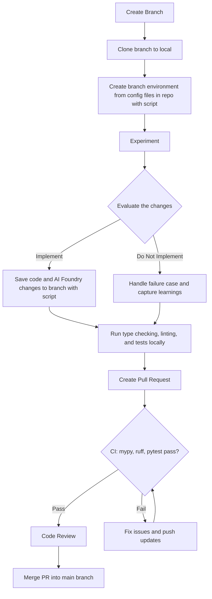

# GenAI Dev Workflow



## Overview

### Inspiration



### Dev Workflow



## Code Quality Requirements

Before creating a pull request, ensure your code meets these standards:

### Type Safety

- **mypy**: All code must pass static type checking
- **Type Annotations**: Complete type hints on all functions and methods
- **Protocol-Based Design**: Core logic uses structural protocols for flexibility

### Code Quality

- **ruff**: All code must pass linting checks
- **Modern Python**: Leverages Python 3.10+ features and best practices
- **Consistent Style**: Automated formatting and style enforcement

### Testing

- **pytest**: All tests must pass with good coverage
- **Unit Tests**: Core functions have comprehensive test coverage
- **Integration Tests**: CLI and end-to-end workflows are tested

### Local Development Commands

```bash
# Type checking
mypy src/

# Linting
ruff check .
ruff check . --fix  # Auto-fix issues

# Testing
pytest tests/ -v
pytest tests/ --cov=src --cov-report=term-missing  # With coverage

# All checks (run before PR)
mypy src/ && ruff check . && pytest tests/
```

## Architecture Notes

### Protocol-Based Design

- Uses `SupportsAgents` protocol instead of concrete Azure SDK classes
- Enables testability with mock implementations
- Allows future async migration without rewriting business logic
- Sync wrapper (`AgentFrameworkAgentsClient`) adapts async Agent Framework SDK

### Dependency Management

- **uv**: Modern Python dependency resolver and project manager
- **pyproject.toml**: All configuration in one place
- **Agent Framework SDK**: Latest async-first Azure AI agent tools

Add data to life cycle - including per environment
Eval could be part of PR in Github flow or part of dev branch in git flow
People and process are needed in addition to technology/platform
Tie thread ID back to the evaluation run in the logs with the Thread ID

CD is either manual or automated
