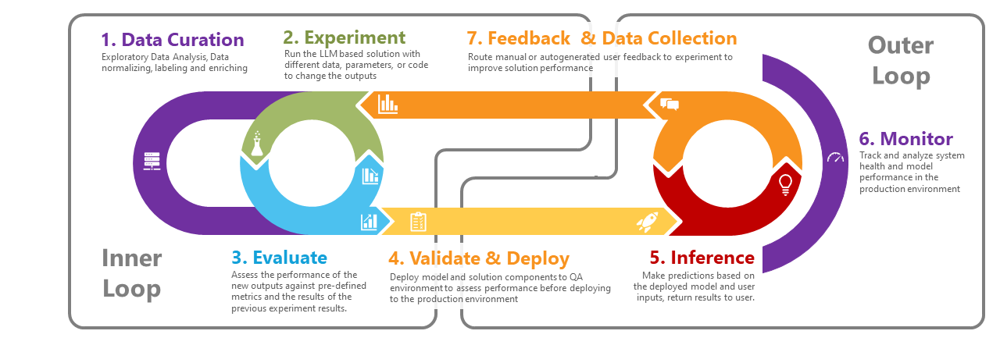
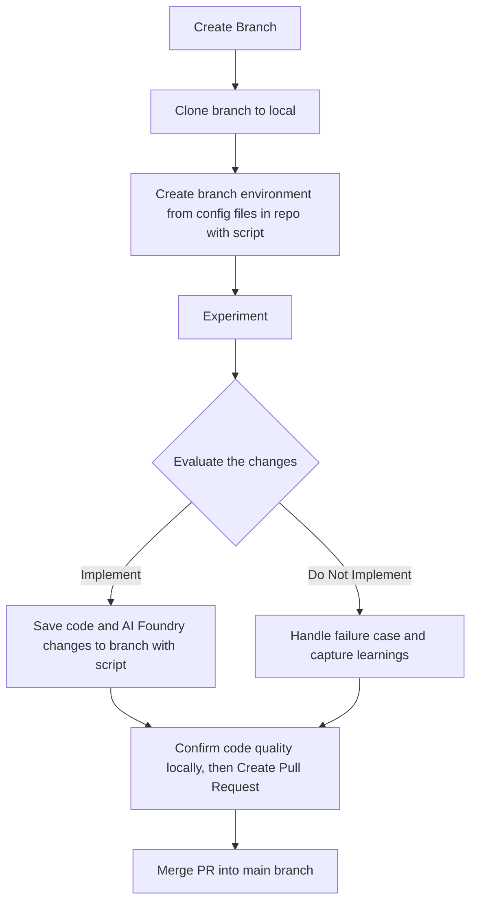
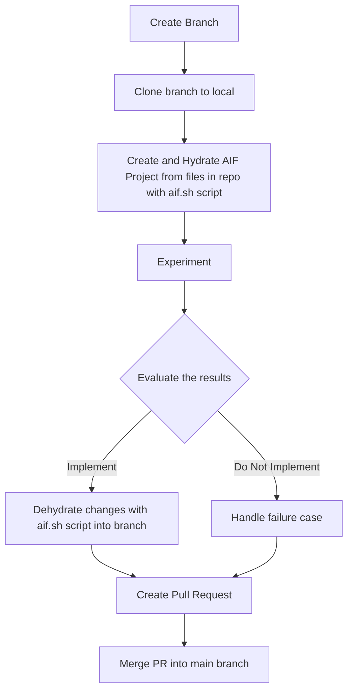

# GenAI Dev Workflow

## Overview

### Inspiration

### Dev Workflow

Add data to life cycle - including per environment
Eval could be part of PR in Github flow or part of dev branch in git flow
People and process are needed in addition to technology/platform
Tie thread ID back to the evaluation run in the logs with the Thread ID

CD is either manual or automated

=======
# Dev Workflow

## Overview

