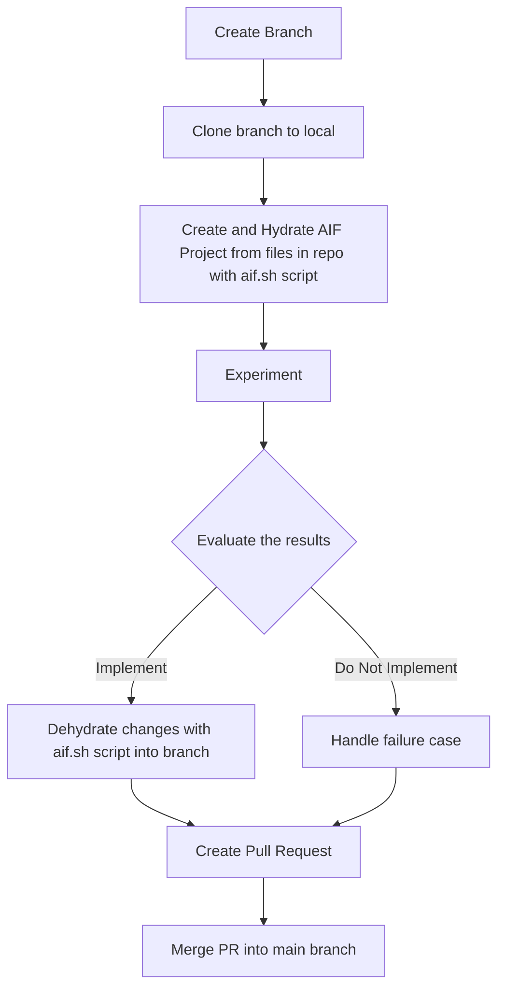

# Dev Workflow

## Overview


```mermaid
graph TD
  CreateBranch[Create Branch] --> Clone[Clone branch to local]
  Clone --> HydrateProject[Create and Hydrate AIF Project from files in repo with aif.sh script]
  HydrateProject --> Experiment
  Experiment --> Evaluate{Evaluate the results}
  Evaluate -->|Implement| Save[Dehydrate changes with aif.sh script into branch]
  Evaluate -->|Do Not Implement| DoNotSave[Handle failure case]
  Save --> PR
  DoNotSave --> PR
  PR[Create Pull Request] --> Merge[Merge PR into main branch]
```

## Steps

### Serialize

```sh
aif.sh -r <resource_url> -g agent
```

### Deserialize

```sh
aif.sh -r <resource_url> -p agent
```
